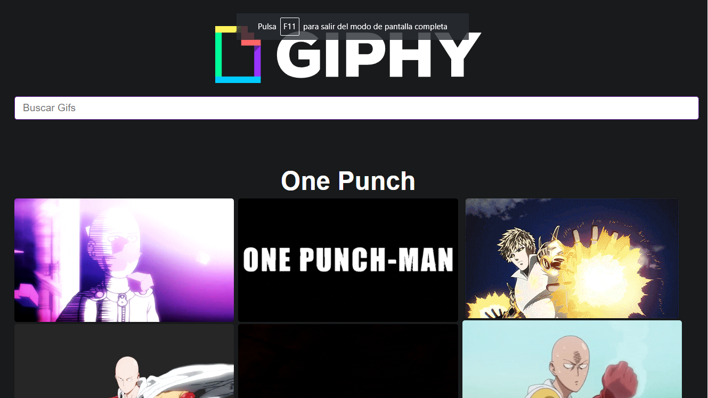

## Api GIPHI
https://developers.giphy.com/docs/api/




# Instalación y configuracion de Jest + React Testing Library
## En proyectos de React + Vite

1. Instalaciones:
```
yarn add --dev jest babel-jest @babel/preset-env @babel/preset-react 
yarn add --dev @testing-library/react @types/jest jest-environment-jsdom
yarn add --dev jest-environment-jsdom
yarn add --dev @testing-library/react
yarn add --dev @types/jest
```

2. Actualizar los scripts del __package.json__
```
"scripts: {
  ...
  "test": "jest --watchAll"
}
```

3. Crear la configuración de babel __babel.config.cjs__
```
//Nombrar el nombre del archivo como babel.config.cjs
module.exports = {
    presets: [
        [ '@babel/preset-env', { targets: { esmodules: true } } ],
        [ '@babel/preset-react', { runtime: 'automatic' } ],
    ],
};
```

4. Crear Jest config y setup:

__jest.config.cjs__
```
//Nombrar el nombre del archivo como jest.config.cjs
module.exports = {
    testEnvironment: 'jest-environment-jsdom',
    setupFiles: ['./jest.setup.js']
}
```

__jest.setup.js__
```
// En caso de necesitar la implementación del FetchAPI
import 'whatwg-fetch'; // <-- yarn add whatwg-fetch
```


